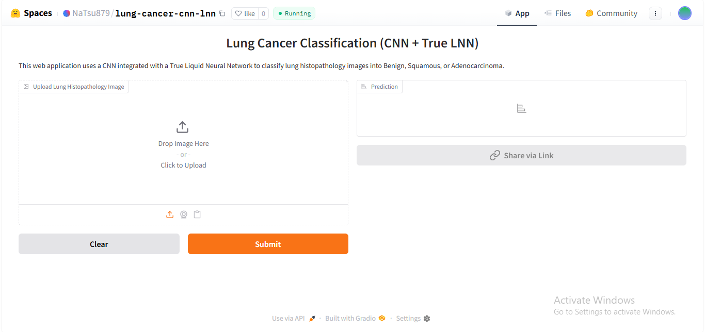
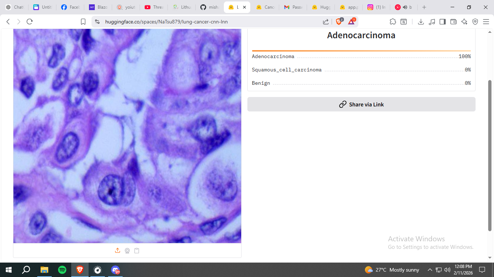

# Hybrid CNN–Liquid Neural Network for Lung Cancer Histopathology Classification 

This repository contains the frontend implementation of a deep learning-based lung cancer histopathology classification system built on a Hybrid Convolutional Neural Network–Liquid Neural Network (CNN–LNN) architecture.

The system classifies histopathological image patches into three clinically significant categories:
Benign Lung Tissue
Lung Adenocarcinoma (LUAD)
Lung Squamous Cell Carcinoma (LUSC)

The project is based on my undergraduate thesis research titled “Hybrid CNN–Liquid Neural Network Architecture for Multi-Class Cancer Histopathology Image Classification.”

# Project Overview

The primary objective of this system is to provide an interactive interface that allows users to upload histopathological image patches and obtain automated classification results generated by a trained deep learning model.

The frontend serves as the user-facing layer of the system and enables seamless communication with the backend model for inference and visualization.

Frontend Responsibilities

The frontend provides the following functionality:

Image upload interface for histopathological patches

Integration with the trained CNN–LNN backend model

Display of predicted class labels and associated probabilities

Visualization of Grad-CAM++ heatmaps for interpretability

Presentation of evaluation metrics such as accuracy, precision, recall, and F1-score

Display of confusion matrices and ROC curve summaries

The interface is designed to be clean, intuitive, and suitable for research demonstration, academic presentation, and potential future clinical decision-support integration.

# System Architecture (Backend Summary)

The backend model integrates:

Pre-trained CNN backbones (EfficientNet-B0, DenseNet121, ResNet50) for hierarchical spatial feature extraction

A Liquid Neural Network (LNN) module for adaptive dynamic feature refinement

A fully connected classification layer with Softmax activation for multi-class prediction

Grad-CAM++ for explainable AI-based visualization

The frontend communicates with the backend inference pipeline to deliver real-time predictions and visual explanations.

Model Performance (Best Experimental Configuration)

Using the ResNet50 backbone within the CNN–LNN framework, the model achieved:

Validation Accuracy: 99.93%
AUC: 1.00 for all classes

Across experiments, the benign class was consistently classified with near-perfect performance. The primary source of confusion occurred between LUAD and LUSC, which is expected due to morphological similarities at the patch level.

# Frontend: Hugging Face
## Frontend UI

### Home / Upload Screen

### Prediction Result Screen

# Motivation

Histopathological cancer diagnosis requires expert interpretation and is both time-consuming and subject to inter-observer variability. This project aims to support AI-assisted pathology by combining strong spatial feature extraction from CNNs with adaptive dynamic modeling through Liquid Neural Networks, while maintaining interpretability through visual explanations.

# Future Improvements

Integration with whole-slide image classification

Cross-validation and multi-run statistical evaluation

External dataset validation for improved generalization

Cloud deployment for scalable real-time inference
